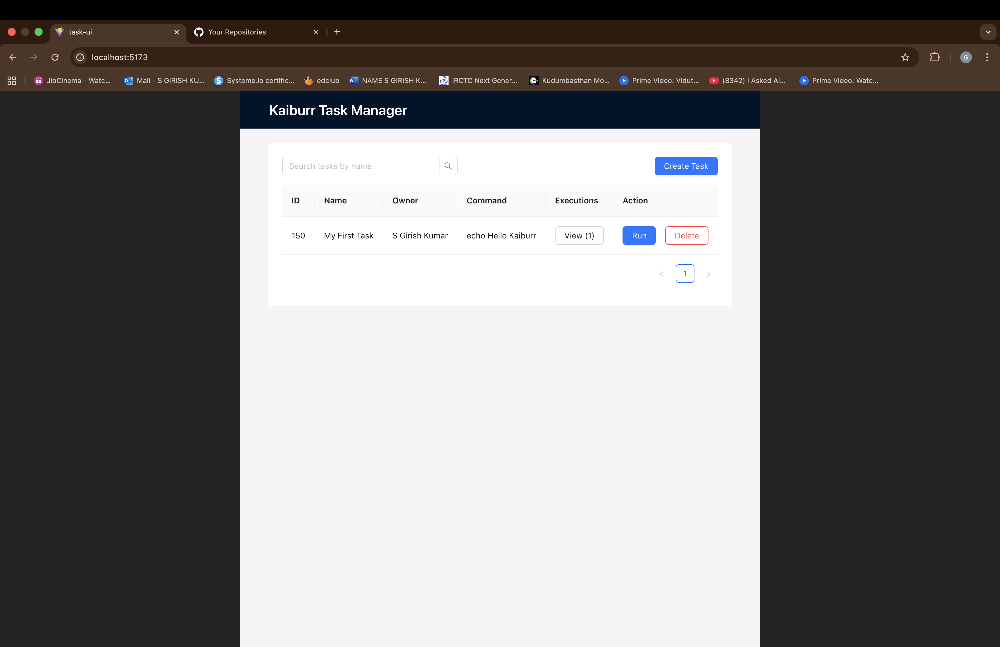

# Kaiburr Task 3: React Web UI

This project is a frontend user interface built with React, TypeScript, and Ant Design to interact with the Task Management API. It allows users to create, view, search, delete, and execute tasks.

---

### Prerequisites

- Node.js and npm
- A running instance of the [Kaiburr Task 1 API Backend](link-to-your-task1-repo).

---

### How to Install and Run

1.  **Clone the repository:**
    ```bash
    git clone <your-repo-url>
    cd kaiburr-task3-react-ui
    ```

2.  **Ensure the Backend is Running:** This UI needs the Java API from Task 1 to be running, typically on `http://localhost:8080`.

3.  **Install dependencies:**
    ```bash
    npm install
    ```

4.  **Run the development server:**
    ```bash
    npm run dev
    ```
    The application will be available at `http://localhost:5173`.

---

### Features

- View a list of all tasks in a table.
- Create new tasks via a modal form.
- Search for tasks by their name.
- Delete tasks with a confirmation dialog.
- Execute tasks directly from the UI.
- View the command output and execution history for each task in a modal.

---

### Screenshots of the UI

**Remember: Each screenshot must show the current date/time and your name.**

#### 1. Main Task List View

*Shows the table with existing tasks.*



#### 2. Create Task Modal

*The form for creating a new task.*


#### 3. Searching for a Task

*Shows the filtered results after a search.*


#### 4. Viewing Command Execution Output

*The modal showing the output from running a command.*


